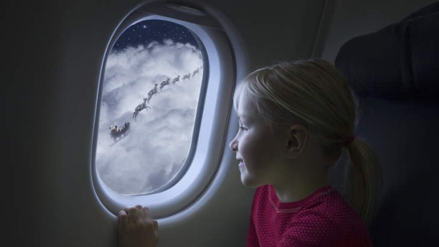

```{r message=FALSE, warning=FALSE}
library(tidyverse)
library(RMySQL)
db <- dbConnect(MySQL(), 
                host = "scidb.smith.edu", 
                user = "mth292", 
                password = "RememberPi", 
                dbname = "airlines")
knitr::opts_chunk$set(connection = db, max.print = 20)

```
<center></center>
Christmas is arguably the most important holiday, families and friends get together to celebrate the holidays. It's the time people apperciated spending time at home with relatives and frinds which often involves traveling home. But flying home can create a lot of stress especially because of the weather and possible delays. In fact, data shows that in 2015 chirstams eve was 6th day in december with the most delays with a total of 200 days of delays.(more comment about the data)
```{sql connection=db}
SELECT  sum(af.dep_delay)/(60*24) as total_delay_days, af.day, af.month
FROM flights af
WHERE af.year =2015 and month=12
GROUP BY af.day
order by total_delay_days desc
limit 0, 20
```
<center></center>
(comment on best ways to travel and avoid delays). Sprit airlines is the worst include funny video of it.
```{sql connection=db}
SELECT ac.carrier, ac.name, af.year, avg(af.dep_delay) as average_delay_min, af.day, af.month
FROM carriers ac
JOIN flights af
on ac.carrier = af.carrier
WHERE af.year= 2015 and af.month=12 and af.day =24
GROUP BY ac.carrier
order by average_delay_min
limit 0,10
```
<iframe width="560" height="315" src="https://www.youtube.com/embed/YvfYK0EEhK4" frameborder="0" allow="accelerometer; autoplay; encrypted-media; gyroscope; picture-in-picture" allowfullscreen></iframe>